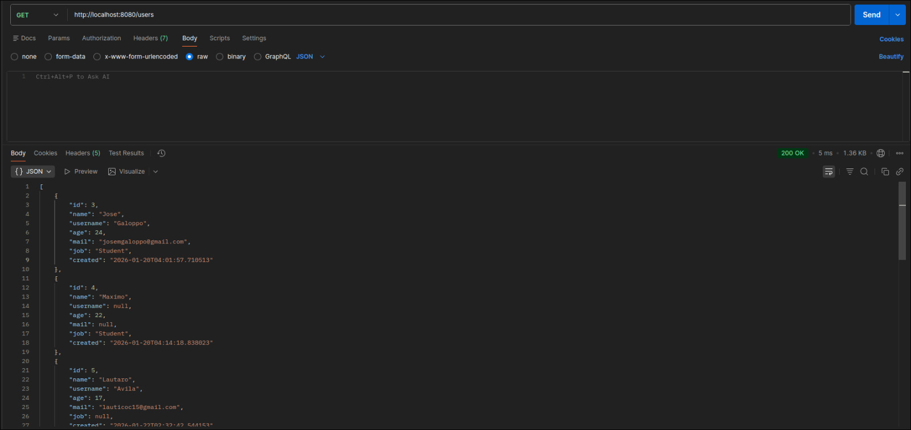
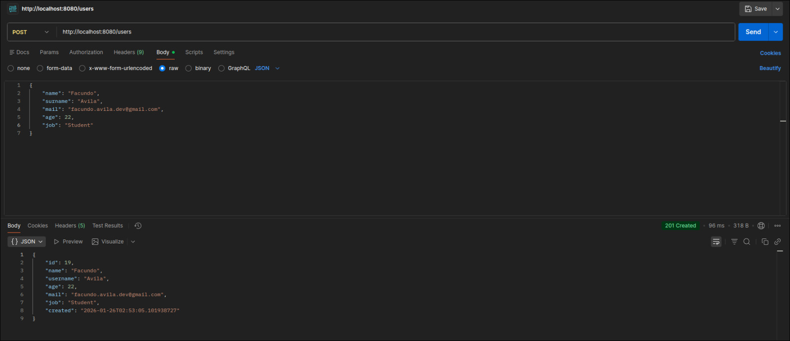

# Users CRUD Application using Spring Boot

This project consists of an API implementation using REST principles. It also involves CRUD methods to modify users data through PostgreSQL database.
To run properly this project, you need to install maven and postgresql. Run a local hosted database and add credentials to venv (otherwise, you can hard-code them on properties.yaml, not recommended)

First, make sure you are properly connected to your local database.
Then, using Postman, you can interact with the API through the following url: http://localhost:8080/users/
There you can create users, find an user by id, delete user, and more functionalities coming in future.

Future features:
- JWT implementation
- More endpoints
- Frontend

## How to use:
Make sure to install al maven dependencies by using mvn clean install

Turn on your PostgreSQL database. Set environment variables in IntelliJ IDEA for DB_NAME, DB_NAME, and DB_PASSWORD of your choice.

Now, send requests to the API, you can use cURL or Postman. Send them to the url: http://localhost:8080/users/

You will receive responses in JSON format.

